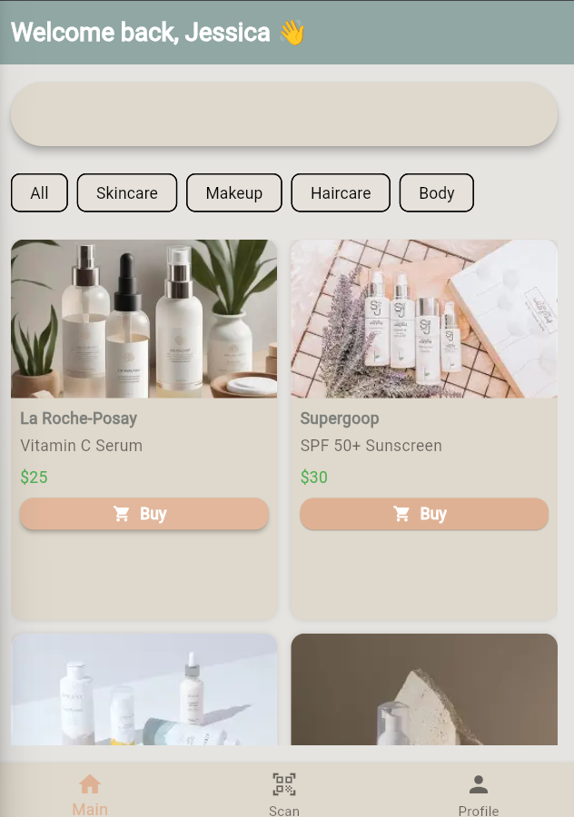
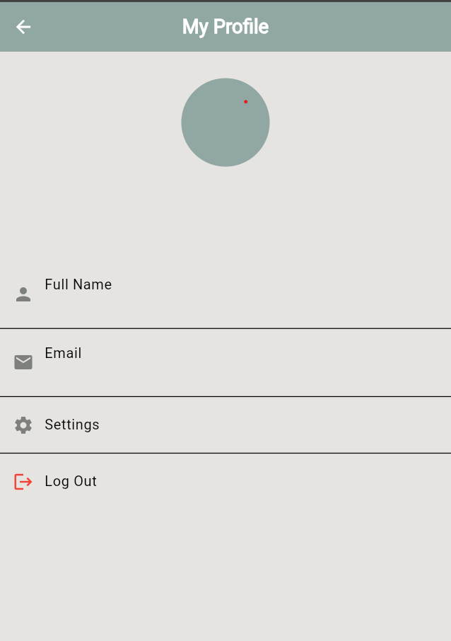

# 🛍️ Korean Skincare Store – Auth & Main Screens

This project is part of a Korean Skincare Store application.  
It contains **Login**, **Sign Up**, **Home**, and **Profile** screens built using **Flutter** and **Firebase Authentication** with **Bloc** for state management.

---

## 1️⃣ Login Screen

**Description:**
- Contains two input fields: **Email** and **Password**.
- **Login** button to authenticate the user.
- A link to navigate to the **Sign Up** screen.
- Email and password validation before submitting.

---

## 2️⃣ Sign Up Screen

**Description:**
- Contains fields: **Full Name**, **Email**, **Password**, and **Confirm Password**.
- **Create Account** button to register a new user.
- A link to navigate to the **Login** screen.
- Data validation such as matching passwords and valid email format.

---

## 3️⃣ Home Screen

**Description:**
- Displays a list of Korean skincare products.
- Each product card contains an **image**, **title**, **description**, and **price**.
- **Navigation bar** for switching between Home, Profile, and other sections.
- Supports scrolling and responsive layout.

---

## 4️⃣ Profile Screen

**Description:**
- Displays user's **profile picture**, **name**, and **email**.
- Options to **edit profile**, **log out**, or view order history.
- Connected to Firebase Authentication for displaying logged-in user info.

---

## 🛠️ Tech Stack
- **Flutter** (Dart)
- **Firebase Authentication**
- **Bloc** (State Management)

---

